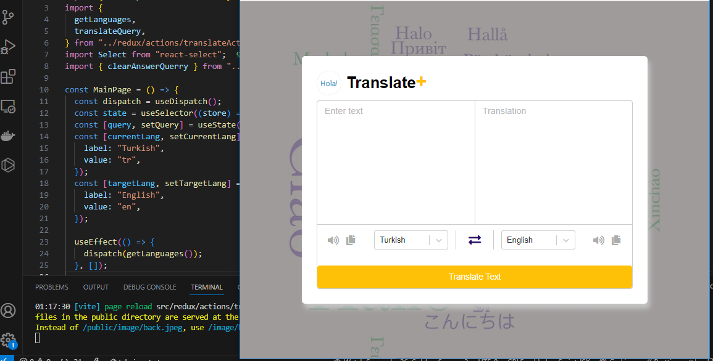

# Translation App

- Bu, metin çevirileri yapmak için kullanılan harika bir uygulamadır. 
- Bu uygulama sayesinde metinleri hızlıca bir dilden diğerine çevirebilirsiniz. 
- Ayrıca diller arasında kolayca geçiş yapabilirsiniz...

## Özellikler

- Metin girişi yapabilirsiniz.
- Kaynak ve hedef dilleri seçebilirsiniz.
- "Çeviri Yap" düğmesine tıklayarak metinleri çevirebilirsiniz.

- RAPID API : 'https://text-translator2.p.rapidapi.com/getLanguages',

# Kullanılan Kütüphaneler
react-router-dom
sass
axios
@reduxjs/toolkit
react-redux
react-select

## Önizleme

Bu projeyi daha da geliştirmek ve kullanıcılar için daha işlevsel hale getirmek için birlikte çalışmayı dört gözle bekliyoruz. İyi kodlamalar! 😊# Translate-ReduxToolkit
